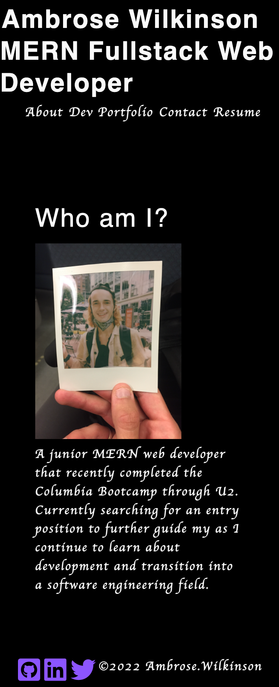
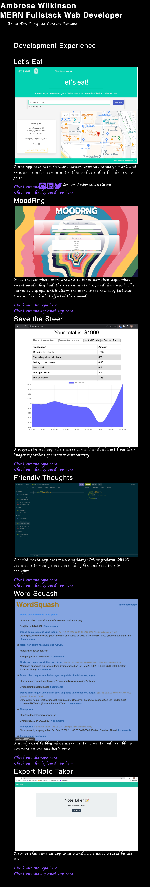

# Port-Flo-Lio React Portfolio 

## Description

A react portfolio showcasing my web development work over the past few months

[GitHub Repo](https://github.com/a-breezy/port-flo-lio)
[Deployed App](https://a-breezy.github.io/port-flo-lio/)

## Table of Contents

  * [Installation](#installation-instructions)
  * [Usage](#usage)
  * [License](#license)
  * [Collaborators](#collaborators)
  * [How to Contribute](#how-to-contribute)
  * [Tests](#tests)
  * [Questions](#questions)

## Installation Instructions

No installation required. But you can view the portfolio itself deployed [here.](https://a-breezy.github.io/port-flo-lio/)
---
## Usage

*Homepage/About*

*Dev Portfolio*

---
## License

  [License: MIT](https://opensource.org/licenses/MIT)
  

---
## Collaborators

None

---
## How to Contribute

None

---
## Tests

None

---
## Questions

ambrose.wilkins@gmail.com
